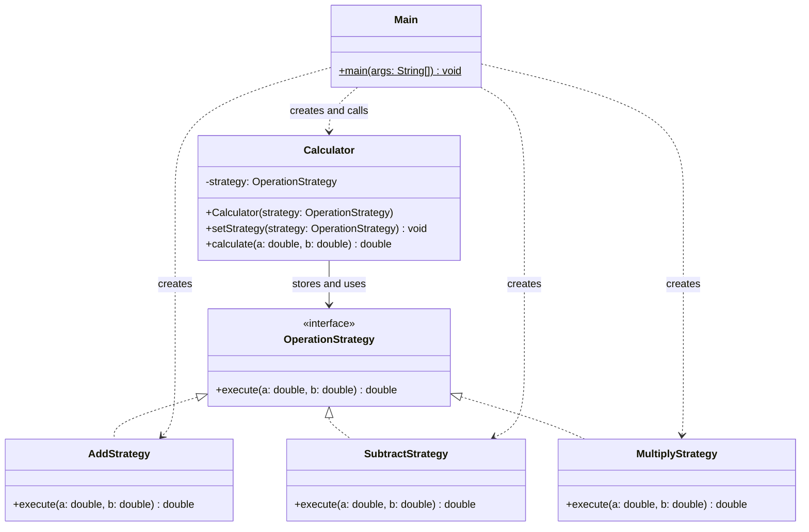

# Strategy Pattern — UML Class Diagram

```mermaid
classDiagram
    direction TB

    class OperationStrategy {
        <<interface>>
        +execute(a: double, b: double) double
    }

    class AddStrategy {
        +execute(a: double, b: double) double
    }

    class SubtractStrategy {
        +execute(a: double, b: double) double
    }

    class MultiplyStrategy {
        +execute(a: double, b: double) double
    }

    class Calculator {
        -strategy: OperationStrategy
        +Calculator(strategy: OperationStrategy)
        +setStrategy(strategy: OperationStrategy) void
        +calculate(a: double, b: double) double
    }

    class Main {
        +main(args: String[]) void$
    }

    OperationStrategy <|.. AddStrategy
    OperationStrategy <|.. SubtractStrategy
    OperationStrategy <|.. MultiplyStrategy

    Calculator --> OperationStrategy : stores and uses
    Main ..> Calculator : creates and calls
    Main ..> AddStrategy : creates
    Main ..> SubtractStrategy : creates
    Main ..> MultiplyStrategy : creates
```